# 🚀 DSA with Python - Complete Guide

<div align="center">


### 📚 Data Structures & Algorithms with Python

**Master DSA with Python - From Basics to Advanced**

**Learning from:** [College Wallah by PW](https://www.youtube.com/@CollegeWallahbyPW)

[⭐ Star this Repo](https://github.com/ranichandnirani/DSA-With-Python) • [🍴 Fork It](https://github.com/ranichandnirani/DSA-With-Python/fork) • [📝 Report Issue](https://github.com/ranichandnirani/DSA-With-Python/issues)

</div>

---

## 📌 About This Repository

This repository contains my complete journey of learning **Data Structures and Algorithms using Python**, following the comprehensive curriculum from **College Wallah by PW**. It includes detailed implementations, explanations, practice problems, and solutions.

**Perfect for:**

- 🎯 Learning DSA from scratch with Python
- 📚 Preparing for technical interviews
- 💡 Understanding algorithm complexity
- 🚀 Building problem-solving skills
- 📖 Quick reference for DSA concepts


---

## 📊 Progress Tracker

<div align="center">

### 🎯 CURRENT PROGRESS: **Starting Journey** 🔥

</div>

| # | Topic | Subtopics | Status |
|---|-------|-----------|--------|
| 01 | **Recursion and Time & Space Complexity** | Big-O, Analysis | 📝 Upcoming |
| 02 | **Arrays** | 1D, 2D, Operations | 📝 Upcoming |
| 03 | **Strings** | Manipulation, Pattern Matching | 📝 Upcoming |
| 04 | **Searching Algorithms** | Linear, Binary Search | 📝 Upcoming |
| 05 | **Sorting Algorithms** | Bubble, Selection, Insertion, Merge, Quick | 📝 Upcoming |
| 06 | **Recursion** | Base case, Recursive calls | 📝 Upcoming |
| 07 | **Backtracking** | N-Queens, Sudoku | 📝 Upcoming |
| 08 | **Linked Lists** | Single, Double, Circular | 📝 Upcoming |
| 09 | **Stacks** | Implementation, Applications | 📝 Upcoming |
| 10 | **Queues** | Simple, Circular, Priority | 📝 Upcoming |
| 11 | **Hashing** | Hash Tables, Hash Maps | 📝 Upcoming |
| 12 | **Trees** | Binary Tree, BST, AVL | 📝 Upcoming |
| 13 | **Heaps** | Min Heap, Max Heap | 📝 Upcoming |
| 14 | **Graphs** | BFS, DFS, Shortest Path | 📝 Upcoming |
| 15 | **Dynamic Programming** | Memoization, Tabulation | 📝 Upcoming |
| 16 | **Greedy Algorithms** | Activity Selection, Huffman | 📝 Upcoming |
| 17 | **Advanced Topics** | Tries, Segment Trees | 📝 Upcoming |

---

## 🎓 Learning Path

```mermaid
graph LR
    A[🌱 Start] --> B[⏱️ Complexity<br/>Analysis]
    B --> C[📊 Arrays &<br/>Strings]
    C --> D[🔍 Searching &<br/>Sorting]
    D --> E[🔄 Recursion &<br/>Backtracking]
    E --> F[🔗 Linear<br/>Structures]
    F --> G[🌳 Trees &<br/>Graphs]
    G --> H[💡 DP &<br/>Greedy]
    H --> I[🎉 Master!]
    
    style A fill:#90EE90,stroke:#2E8B57,stroke-width:3px,color:#000
    style B fill:#87CEEB,stroke:#4682B4,stroke-width:3px,color:#000
    style C fill:#FFB6C1,stroke:#FF69B4,stroke-width:3px,color:#000
    style D fill:#F0E68C,stroke:#DAA520,stroke-width:3px,color:#000
    style E fill:#DDA0DD,stroke:#9370DB,stroke-width:3px,color:#000
    style F fill:#FFA07A,stroke:#FF6347,stroke-width:3px,color:#000
    style G fill:#98D8C8,stroke:#20B2AA,stroke-width:3px,color:#000
    style H fill:#B0C4DE,stroke:#4169E1,stroke-width:3px,color:#000
    style I fill:#FFD700,stroke:#FF8C00,stroke-width:4px,color:#000
```



---

## 🚀 Quick Start

### Prerequisites

```bash
✅ Python 3.8 or higher
✅ Code Editor (VS Code, PyCharm recommended)
✅ Basic Python knowledge
✅ Problem-solving mindset
```

### Installation & Setup

```bash
# Clone the repository
git clone https://github.com/ranichandnirani/DSA-With-Python.git

# Navigate to the folder
cd DSA-With-Python

# Choose any topic folder
cd "01-Time-Space-Complexity"

# Run Python file
python solution.py
```

---

## 📂 Repository Structure

```
📦 DSA-With-Python
├── 📁 01-Time-Space-Complexity
│   ├── theory.md
│   ├── examples.py
│   └── problems/
├── 📁 02-Arrays
│   ├── theory.md
│   ├── 1d-arrays.py
│   ├── 2d-arrays.py
│   └── problems/
├── 📁 03-Strings
│   ├── theory.md
│   ├── operations.py
│   └── problems/
├── 📁 04-Searching-Algorithms
│   ├── linear_search.py
│   ├── binary_search.py
│   └── problems/
├── 📁 05-Sorting-Algorithms
│   ├── bubble_sort.py
│   ├── selection_sort.py
│   ├── insertion_sort.py
│   ├── merge_sort.py
│   ├── quick_sort.py
│   └── problems/
├── 📁 06-Recursion
│   ├── theory.md
│   ├── examples.py
│   └── problems/
├── 📁 07-Backtracking
│   └── problems/
├── 📁 08-Linked-Lists
│   ├── singly_linked_list.py
│   ├── doubly_linked_list.py
│   └── problems/
├── 📁 09-Stacks
│   └── implementation.py
├── 📁 10-Queues
│   └── implementation.py
├── 📁 11-Hashing
│   └── hash_table.py
├── 📁 12-Trees
│   ├── binary_tree.py
│   ├── bst.py
│   └── problems/
├── 📁 13-Heaps
│   └── heap.py
├── 📁 14-Graphs
│   ├── graph.py
│   ├── bfs.py
│   ├── dfs.py
│   └── problems/
├── 📁 15-Dynamic-Programming
│   └── problems/
├── 📁 16-Greedy-Algorithms
│   └── problems/
├── 📁 17-Advanced-Topics
│   └── problems/
├── 📄 README.md
├── 📄 .gitignore
└── 📄 LICENSE
```

---

## 💡 Topics Overview

### 📚 **Fundamentals**

<details>
<summary><b>⏱️ Time & Space Complexity</b></summary>

- Big-O Notation
- Time Complexity Analysis
- Space Complexity Analysis
- Best, Average, Worst Case
- Amortized Analysis
</details>

<details>
<summary><b>📊 Arrays</b></summary>

- 1D Arrays
- 2D Arrays (Matrix)
- Array Operations
- Subarrays & Subsequences
- Kadane's Algorithm
- Sliding Window Technique
</details>

<details>
<summary><b>📝 Strings</b></summary>

- String Basics
- Pattern Matching (KMP, Rabin-Karp)
- String Manipulation
- Palindromes
- Anagrams
</details>

### 🔍 **Searching & Sorting**

<details>
<summary><b>🔎 Searching Algorithms</b></summary>

- Linear Search
- Binary Search
- Binary Search Variations
- Ternary Search
</details>

<details>
<summary><b>🔄 Sorting Algorithms</b></summary>

- Bubble Sort
- Selection Sort
- Insertion Sort
- Merge Sort
- Quick Sort
- Heap Sort
- Counting Sort
- Radix Sort
</details>

### 🔁 **Recursion & Backtracking**

<details>
<summary><b>🔄 Recursion</b></summary>

- Recursion Basics
- Tail Recursion
- Tree Recursion
- Indirect Recursion
- Tower of Hanoi
- Fibonacci Series
</details>

<details>
<summary><b>⬅️ Backtracking</b></summary>

- N-Queens Problem
- Sudoku Solver
- Rat in a Maze
- Subset Sum
- Permutations & Combinations
</details>

### 🔗 **Linear Data Structures**

<details>
<summary><b>🔗 Linked Lists</b></summary>

- Singly Linked List
- Doubly Linked List
- Circular Linked List
- Common Operations
- Reverse, Cycle Detection
</details>

<details>
<summary><b>📚 Stacks</b></summary>

- Stack Implementation
- Applications (Parenthesis Matching, Infix to Postfix)
- Stock Span Problem
- Next Greater Element
</details>

<details>
<summary><b>🚶 Queues</b></summary>

- Simple Queue
- Circular Queue
- Priority Queue
- Deque
- Applications
</details>

### 🌳 **Non-Linear Data Structures**

<details>
<summary><b>#️⃣ Hashing</b></summary>

- Hash Tables
- Hash Functions
- Collision Handling
- Hash Maps
- Hash Sets
</details>

<details>
<summary><b>🌳 Trees</b></summary>

- Binary Tree
- Binary Search Tree (BST)
- AVL Tree
- Tree Traversals (Inorder, Preorder, Postorder)
- Level Order Traversal
- LCA, Height, Diameter
</details>

<details>
<summary><b>⛰️ Heaps</b></summary>

- Min Heap
- Max Heap
- Heap Operations
- Heap Sort
- Priority Queue using Heap
</details>

<details>
<summary><b>🕸️ Graphs</b></summary>

- Graph Representation
- BFS (Breadth-First Search)
- DFS (Depth-First Search)
- Shortest Path (Dijkstra, Bellman-Ford)
- Minimum Spanning Tree (Kruskal, Prim)
- Topological Sort
- Cycle Detection
</details>

### 💡 **Advanced Algorithms**

<details>
<summary><b>💰 Dynamic Programming</b></summary>

- Memoization
- Tabulation
- 0/1 Knapsack
- Longest Common Subsequence
- Longest Increasing Subsequence
- Matrix Chain Multiplication
- Edit Distance
</details>

<details>
<summary><b>🎯 Greedy Algorithms</b></summary>

- Activity Selection
- Fractional Knapsack
- Job Sequencing
- Huffman Coding
- Minimum Platforms
</details>

<details>
<summary><b>🚀 Advanced Topics</b></summary>

- Tries
- Segment Trees
- Fenwick Tree (BIT)
- Disjoint Set Union (DSU)
- String Algorithms
</details>

---

## 📚 Learning Resources

### 📺 Video Courses

- [🎓 College Wallah by PW (Primary Source)](https://www.youtube.com/@CollegeWallahbyPW)
- [📹 Abdul Bari - Algorithms](https://www.youtube.com/@abdul_bari)
- [🎥 freeCodeCamp DSA](https://www.youtube.com/@freecodecamp)

### 📖 Documentation & Websites

- [📚 GeeksforGeeks DSA](https://www.geeksforgeeks.org/data-structures/)
- [💻 LeetCode](https://leetcode.com/)
- [🎯 HackerRank](https://www.hackerrank.com/)
- [📘 Python Data Structures](https://docs.python.org/3/tutorial/datastructures.html)

### 📕 Books

- Introduction to Algorithms (CLRS)
- Grokking Algorithms
- Data Structures and Algorithms in Python
- Cracking the Coding Interview

### 🎮 Practice Platforms

- [LeetCode](https://leetcode.com/)
- [HackerRank](https://www.hackerrank.com/)
- [CodeChef](https://www.codechef.com/)
- [Codeforces](https://codeforces.com/)
- [InterviewBit](https://www.interviewbit.com/)

---

## 🎯 Learning Goals

### 📝 Short-term Goals
- ✅ Complete basics (Arrays, Strings)
- ✅ Master searching & sorting
- ✅ Understand recursion thoroughly
- ✅ Implement all linear data structures

### 🚀 Long-term Goals
- 🎯 Solve 200+ DSA problems
- 🎯 Master Dynamic Programming
- 🎯 Complete all graph algorithms
- 🎯 Prepare for technical interviews
- 🎯 Build complex projects using DSA

---

## 📊 Statistics

```
📚 Total Topics: 17
✅ Completed: 0
🔄 In Progress: Starting
📝 Remaining: 17
💻 Problems Solved: 0
⏱️ Estimated Time: 150-200 hours
🎓 Difficulty: Beginner to Advanced
📝 Language: 100% Python
```

---

## 🤝 Contributing

Contributions are welcome! Here's how you can help:

1. 🍴 Fork the repository
2. 🌿 Create a feature branch (`git checkout -b feature/NewTopic`)
3. ✍️ Commit your changes (`git commit -m 'Add new solution'`)
4. 📤 Push to the branch (`git push origin feature/NewTopic`)
5. 🔃 Open a Pull Request

**Contribution Ideas:**

- 🐛 Fix bugs or improve solutions
- ✨ Add more problems
- 📝 Improve documentation
- 💡 Add alternative solutions
- 🎯 Add visual explanations

---

## 🌟 Features

- ✅ **Comprehensive Coverage**: All major DSA topics
- ✅ **Python Implementation**: Clean, readable code
- ✅ **Theory + Practice**: Concept explanations + problems
- ✅ **College Wallah Curriculum**: Following proven path
- ✅ **Interview Focused**: Common interview problems
- ✅ **Progressive Difficulty**: Easy to Hard
- ✅ **Well-Documented**: Comments and explanations
- ✅ **Regular Updates**: Continuous learning

---

## 📄 License

This project is licensed under the **MIT License** - feel free to use for learning and teaching!

[](LICENSE)

---

## 🌟 Show Your Support

If this repository helped you learn DSA:

⭐ **Star** this repository  
🍴 **Fork** for your reference  
📢 **Share** with fellow learners  
🤝 **Contribute** to improve it  

---

## 🔗 Connect With Me

<div align="center">

[](https://github.com/ranichandnirani)
[](https://www.linkedin.com/in/chandni-rani)

</div>

---

## 💬 Support

Need help or have questions?

- 💡 [Open an Issue](https://github.com/ranichandnirani/DSA-With-Python/issues)
- 📧 Email: chandnirani229@gmail.com
- 🌐 GitHub: [@ranichandnirani](https://github.com/ranichandnirani)

---

## 🙏 Acknowledgments

Special thanks to:
- **College Wallah by PW** for excellent teaching
- The open-source community
- All contributors and supporters

---

<div align="center">

### 🚀 Let's Master DSA Together! 🚀

**Made with ❤️ and ☕ by Chandni Rani**

_Journey of thousand problems begins with a single solution!_ 💻✨

---


**⭐ If this helped you, please star this repository! ⭐**

</div>