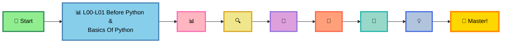

# 🚀 DSA with Python - Complete Guide

<div align="center">


### 📚 Data Structures & Algorithms with Python

**Master DSA with Python - From Basics to Advanced**

**Learning from:** [College Wallah by PW](https://www.youtube.com/@CollegeWallahbyPW)

[⭐ Star this Repo](https://github.com/ranichandnirani/DSA-With-Python) • [🍴 Fork It](https://github.com/ranichandnirani/DSA-With-Python/fork) • [📝 Report Issue](https://github.com/ranichandnirani/DSA-With-Python/issues)

</div>

---

## 📌 About This Repository

This repository contains my complete journey of learning **Data Structures and Algorithms using Python**, following the comprehensive curriculum from **College Wallah by PW**. It includes detailed implementations, explanations, practice problems, and solutions.

**Perfect for:**

- 🎯 Learning DSA from scratch with Python
- 📚 Preparing for technical interviews
- 💡 Understanding algorithm complexity
- 🚀 Building problem-solving skills
- 📖 Quick reference for DSA concepts


---

## 📊 Progress Tracker

<div align="center">

### 🎯 CURRENT PROGRESS: **Starting Journey** 🔥

</div>

| # | Topic | Subtopics | Status |
|---|-------|-----------|--------|
| L00 | **Before Python** | What is Programming Language, High Level Programming Language VS Low Level Programming Language |✅ Completed |
| L01 | **Basics Of Python** | Operators, Data Types | ✅ Completed |


---

## 🎓 Learning Path


```mermaid
graph LR
    A[🌱 Start] --> B[📊 L00-L01 Before Python &<br/>Basics Of Python]
    B --> C[📊 ]
    C --> D[🔍 ]
    D --> E[🔄 ]
    E --> F[🔗 ]
    F --> G[🌳 ]
    G --> H[💡 ]
    H --> I[🎉 Master!]
    
    style A fill:#90EE90,stroke:#2E8B57,stroke-width:3px,color:#000
    style B fill:#87CEEB,stroke:#4682B4,stroke-width:3px,color:#000
    style C fill:#FFB6C1,stroke:#FF69B4,stroke-width:3px,color:#000
    style D fill:#F0E68C,stroke:#DAA520,stroke-width:3px,color:#000
    style E fill:#DDA0DD,stroke:#9370DB,stroke-width:3px,color:#000
    style F fill:#FFA07A,stroke:#FF6347,stroke-width:3px,color:#000
    style G fill:#98D8C8,stroke:#20B2AA,stroke-width:3px,color:#000
    style H fill:#B0C4DE,stroke:#4169E1,stroke-width:3px,color:#000
    style I fill:#FFD700,stroke:#FF8C00,stroke-width:4px,color:#000
```

---

## 🚀 Quick Start

### Prerequisites

```bash
✅ Python 3.8 or higher
✅ Code Editor (VS Code, PyCharm recommended)
✅ Basic Python knowledge
✅ Problem-solving mindset
```

### Installation & Setup

```bash
# Clone the repository
git clone https://github.com/ranichandnirani/DSA-With-Python.git

# Navigate to the folder
cd DSA-With-Python

# Choose any topic folder
cd "01-Time-Space-Complexity"

# Run Python file
python solution.py
```

---

## 📂 Repository Structure

```
📦 DSA-With-Python
├── 📁 L00-Before-Python
│   ├── theory.txt
├── 📁 L01-Basics Of Python
│   ├── 001 Operators/
│   ├── 002-Datatypes/
│   ├── theory.txt
├── 📄 README.md
├── 📄 .gitignore
└── 📄 LICENSE
```

---

## 💡 Topics Overview

### 📚 **Fundamentals**

<details>
<summary><b>🎯 Before Python</b></summary>

- What is Programming Language
- High Level Programming Language Vs Low Level Programming Language
- Compiler Vs Interpreter
</details>

<details>
<summary><b>📊 Basics Of Python</b></summary>

- Operaators
- Datatypes
</details>

---

## 📚 Learning Resources

### 📺 Video Courses

- [🎓 College Wallah by PW (Primary Source)](https://www.youtube.com/@CollegeWallahbyPW)
- [📹 Abdul Bari - Algorithms](https://www.youtube.com/@abdul_bari)
- [🎥 freeCodeCamp DSA](https://www.youtube.com/@freecodecamp)

### 📖 Documentation & Websites

- [📚 GeeksforGeeks DSA](https://www.geeksforgeeks.org/data-structures/)
- [💻 LeetCode](https://leetcode.com/)
- [🎯 HackerRank](https://www.hackerrank.com/)
- [📘 Python Data Structures](https://docs.python.org/3/tutorial/datastructures.html)

### 📕 Books

- Introduction to Algorithms (CLRS)
- Grokking Algorithms
- Data Structures and Algorithms in Python
- Cracking the Coding Interview

### 🎮 Practice Platforms

- [LeetCode](https://leetcode.com/)
- [HackerRank](https://www.hackerrank.com/)
- [CodeChef](https://www.codechef.com/)
- [Codeforces](https://codeforces.com/)
- [InterviewBit](https://www.interviewbit.com/)

---

## 🎯 Learning Goals

### 📝 Short-term Goals
- ✅ Before Python
- ✅ Basics Of Python

### 🚀 Long-term Goals
- 🎯 Solve 200+ DSA problems
- 🎯 Master Dynamic Programming
- 🎯 Complete all graph algorithms
- 🎯 Prepare for technical interviews
- 🎯 Build complex projects using DSA

---

## 📊 Statistics

```
📚 Total Topics: 17
✅ Completed: 0
🔄 In Progress: Starting
📝 Remaining: 17
💻 Problems Solved: 0
⏱️ Estimated Time: 150-200 hours
🎓 Difficulty: Beginner to Advanced
📝 Language: 100% Python
```

---

## 🤝 Contributing

Contributions are welcome! Here's how you can help:

1. 🍴 Fork the repository
2. 🌿 Create a feature branch (`git checkout -b feature/NewTopic`)
3. ✍️ Commit your changes (`git commit -m 'Add new solution'`)
4. 📤 Push to the branch (`git push origin feature/NewTopic`)
5. 🔃 Open a Pull Request

**Contribution Ideas:**

- 🐛 Fix bugs or improve solutions
- ✨ Add more problems
- 📝 Improve documentation
- 💡 Add alternative solutions
- 🎯 Add visual explanations

---

## 🌟 Features

- ✅ **Comprehensive Coverage**: All major DSA topics
- ✅ **Python Implementation**: Clean, readable code
- ✅ **Theory + Practice**: Concept explanations + problems
- ✅ **College Wallah Curriculum**: Following proven path
- ✅ **Interview Focused**: Common interview problems
- ✅ **Progressive Difficulty**: Easy to Hard
- ✅ **Well-Documented**: Comments and explanations
- ✅ **Regular Updates**: Continuous learning

---

## 📄 License

This project is licensed under the **MIT License** - feel free to use for learning and teaching!

[](LICENSE)

---

## 🌟 Show Your Support

If this repository helped you learn DSA:

⭐ **Star** this repository  
🍴 **Fork** for your reference  
📢 **Share** with fellow learners  
🤝 **Contribute** to improve it  

---

## 🔗 Connect With Me

<div align="center">

[](https://github.com/ranichandnirani)
[](https://www.linkedin.com/in/chandni-rani)

</div>

---

## 💬 Support

Need help or have questions?

- 💡 [Open an Issue](https://github.com/ranichandnirani/DSA-With-Python/issues)
- 📧 Email: chandnirani229@gmail.com
- 🌐 GitHub: [@ranichandnirani](https://github.com/ranichandnirani)

---

## 🙏 Acknowledgments

Special thanks to:
- **College Wallah by PW** for excellent teaching
- The open-source community
- All contributors and supporters

---

<div align="center">

### 🚀 Let's Master DSA Together! 🚀

**Made with ❤️ and ☕ by Chandni Rani**

_Journey of thousand problems begins with a single solution!_ 💻✨

---


**⭐ If this helped you, please star this repository! ⭐**

</div>